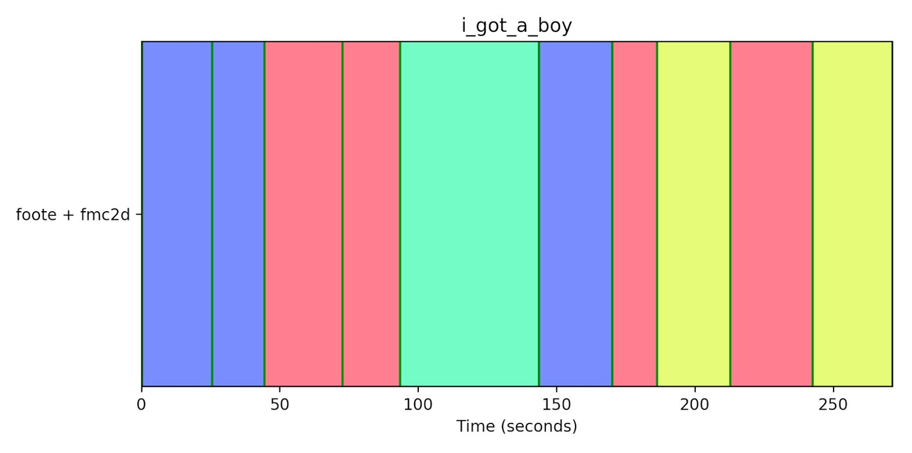
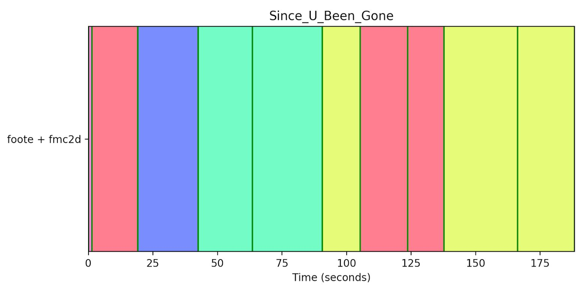
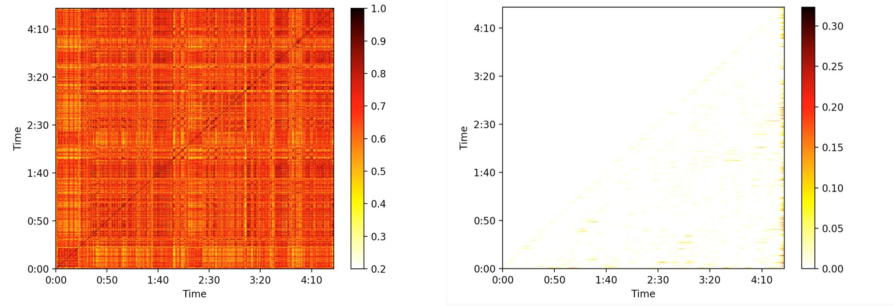
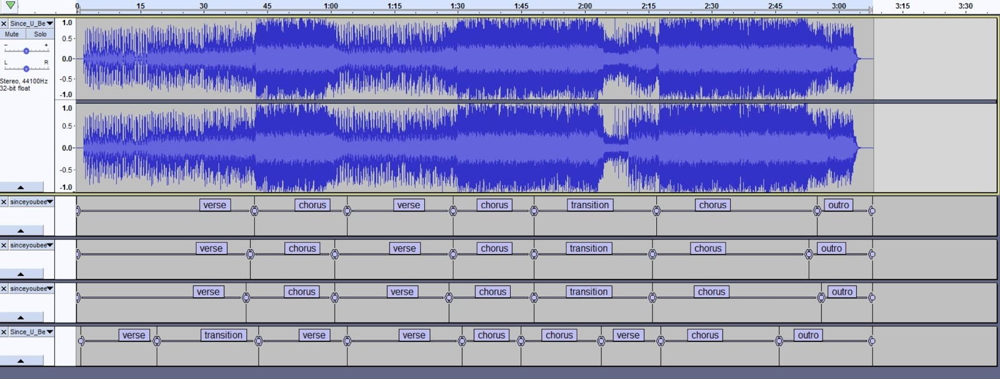
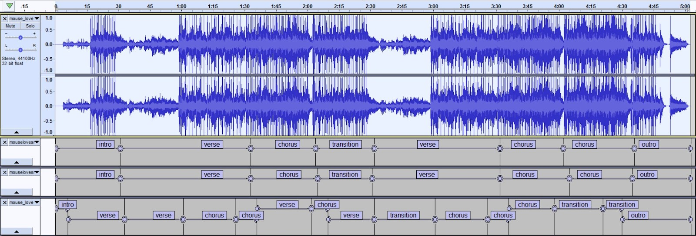
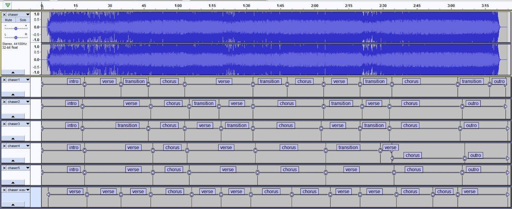
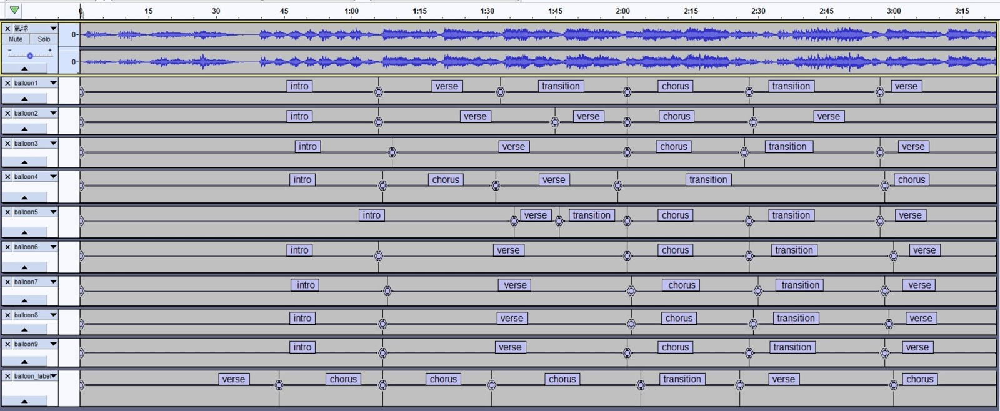
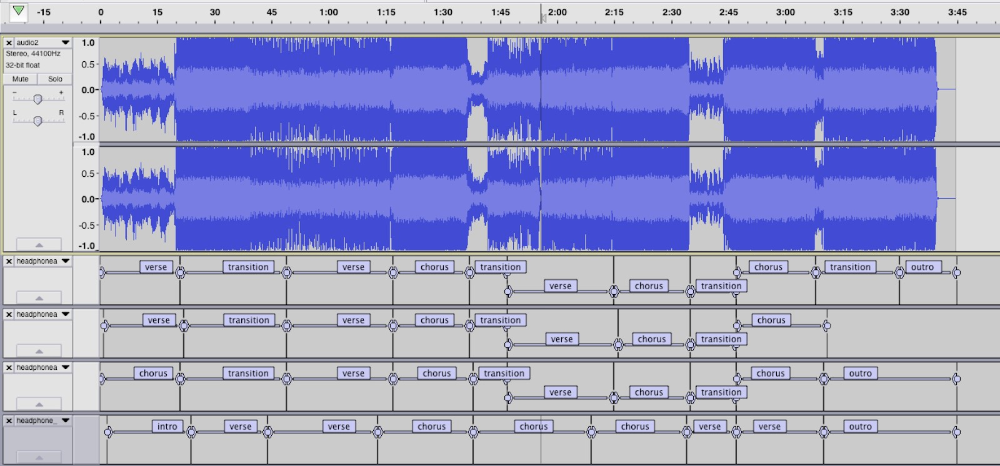

# A Study on Machine vs. Human Perception of Pop Song Structure

### feat. Karen Bao, Stacey Chao, Vivian Chen   

## Intro 

Structure makes a song catchy providing a balance between repetition and variation, despite the fact that we aren’t always actively aware of it when we’re listening to the song. Songs usually consist of a few different sections: intro, verse, chorus, bridge (or transition), and outro. Sometimes it is obvious where each section ends/begins and whether a section is the chorus, verse, etc.; other times…not so much. In this project, we focus on pop songs and whether machines perceive/detect structures similar to how people detect them, especially when a song’s structure is vague even to human ears.

## How We Built It

We created our program by building off of two sources of code: Oriol Nieto's [song segmenter](https://github.com/urinieto/msaf) and Vivek Jayaram's [chorus detector](https://github.com/vivjay30/pychorus). For the former, we used MSAF to run a novelty-based segmentation and labeling algorithm. Specifically, this involved using the [checkerboard kernel method](https://www.fxpal.com/publications/automatic-audio-segmentation-using-a-measure-of-audio-novelty.pdf) of audio segmentation proposed by Jonathan Foote, and a [2D Fourier Magnitude Coefficients Method](http://www.mirlab.org/conference_papers/International_Conference/ICASSP%202014/papers/p664-nieto.pdf) as proposed by Oriol Nieto and Juan Pablo Bello. Running this algorithm on the song gives the perceived segments of a song and generic segment labels (1, 2, 1, 2, 3, etc.).

    <em>Segments and labels determined for SNSD’s song “I Got a Boy”. The lines represent each perceived song segment, while the colors represent each perceived segment label.</em>

    <em>Segments and labels determined for Kelly Clarkson’s song “Since You Been Gone”.</em>

The chorus detector is a simplified version of an algorithm presented by a [paper](https://staff.aist.go.jp/m.goto/PAPER/IEEETASLP200609goto.pdf) by Masataka Goto. However, the detector determines the chorus based on repetition (the more it repeated, the more likely it was a chorus), not on musical characteristics. This turned out to misidentify choruses on a large majority of songs, so we modified the algorithm to return all repeated segments. We then used [Librosa](https://librosa.github.io/librosa/)’s beat onset feature to identify which segment was most likely to be the chorus, using the logic that the segment with the highest average beat onset would be considered the chorus. 

    <em>The time-time and denoised time-lag similarity matrices for “I Got a Boy”. The matrices are used to determine the repeating segments within a song.</em>

    <em>The time-time and denoised time-lag similarity matrices for Kelly Clarkson's "Since You Been Gone".</em>

With the chorus identified, we looped through the detected segments from the segmenter and found the best matching segments to the detected chorus. Segments were matched using dynamic time warping (using a modified version of the algorithm from [https://pypi.org/project/fastdtw/](https://pypi.org/project/fastdtw/)). If the similarity between the segment and the detected chorus was under a certain value, then that segment would then be labeled a chorus.

The remaining segments were determined through the previous labels given by the 2D Fourier Magnitude Coefficient labeling algorithm. If a segment was repeating but had not been labeled as a chorus, it was then labeled as a verse. If the segment was unique and in the middle of a song, it was considered a transition. If the first or final segments were unique, they were assigned as “intro” or “outro”, respectively.

## The Program

Our program returns a text file delimiting the time stamps of each segment of a song, which we uploaded into [Audacity](https://manual.audacityteam.org/man/creating_and_selecting_labels.html). 

## User Testing

We ran user testing on 9 subjects, all of whom are college students who listen to pop songs regularly. Each user listened to 2 random pop songs, one with a relatively simple structure one and one with a more complex structure, from 4 different genres of pop: American pop, Japanese pop, Korean pop, and Chinese pop. We used different genre of pop to ensure that user would not be familiar with all the songs. We also wanted to highlight than an understanding of the lyrics of a song would not affect one’s perception of the song’s structure. 

The user’s task was to give the start and stop timestamps of each particular section (intro, verse, chorus, transition, outro) that they had heard. The users were told that the song could only have one intro and one outro, but could have any number of verse, chorus, and transition segments. The segments could also not be numbered (i.e. verse 1, chorus 2,. etc).

## Results

Here are some examples of comparisons of user labels vs. labels generated from our program. The labels generated from the program are always the labels on the last row (see screenshots). See what you agree with!

    <em>Song (Easy American): Since You Been Gone – Kelly Clarkson</em>

<audio controls preload> 
    <source src="audio/sinceubeengone.mp3"></source>
    <source src="audio/sinceubeengone.ogg"></source> 
</audio>

  

    <em>Song (Easy Chinese): Mouse Loves Rice – Yang Chengang</em>

<audio controls preload> 
    <source src="audio/mouselovesrice.mp3"></source> 
</audio>

  

    <em>Song (Easy Korean): The Chaser – INFINITE</em>

  

    <em>Song (Difficult Chinese): Balloon – Peggy Hsu</em>

  

    <em>Song (Difficult Japanese): Headphone Actor – Jin</em>

## Future Work

In the future, we would like to improve our chorus detection algorithm. Currently the two features we use to detect the chorus are beat onsets and repetition, but we would also want to use such features like chord progression, frequency bands, peak strength, and maybe even vocal analysis. We believe the inclusion of such features would help our algorithm match how a regular person would try to segment a song. In general, the checkerboard kernel method was a decent method of segmenting songs, but we could also experiment with different algorithms. We would also want to rely less on the labels given by the 2D-Fourier Magnitude Coefficients algorithm, and use our own method of determining a general song structure. Finally, we would want to expand our user study to have a larger sample population, in order to more clearly see trends and patterns in user labeling. 

## In Conclusion...

People have extremely different ideas of how a song is structured, especially for hard songs; someone’s verse might be someone else’s chorus. Some users’ labels even are similar to those generated by the program while very different from other users’ labels. In the end, what really defines song structure? How can we even identify common segments within a song, such as a “verse”, “chorus”, and “transition”? While there may not be a single general method of determining structure, it is valuable to study how different users can perceive them, and if one can get machines to replicate such reasoning. 

  
